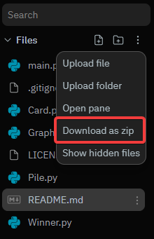

# Red 7
/pic2247258.png)
A python implementation of the card game Red 7.

**ALL RULES ARE EXPLAINED IN [rules.md](rules.md)**

## Getting Started
I highly reccomend running this program on a local machine instead of replit, due to replit's console being very slow. This causes a scanning effect, whereas on a local machine everything runs smoothly. If you cannot install onto local machine, the replit shell generally runs faster than the console.

### Prerequisits
- Python 3.9+

### Install (Local Machines)
**Download the code onto your machine**

If you have git installed you can clone from the github repository

```bash
> git clone https://github.com/TheeeEVan/red7
```

Otherwise you can download the project directly from replit



## Usage
### Running the Program
Open a terminal in the project directory

Run the main python file

```bash
> python main.py
```

