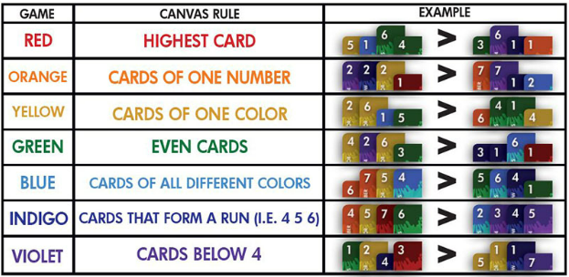

# Rules 📖
**NOTE:** In the python script, the difference between Indigo and Violet were very hard to see, so Violet is rendered as Pink in the game.
## The Cards 🃏
- There are 49 cards a deck
	- Each card is assigned a number from 1-7
	- Each card is assigned a color (Red, Orange, Yellow, Green, Blue, Indigo, Violet)

### Card Worth

When comparing two cards, the card with the highest number will always be worth more. However, if both cards have the same number, the color which appears first in a rainbow *(Red, Orange, Yellow, Green, Blue, Indigo, Violet)* is worth more. For example a green 6 is worth more than a blue 6. This makes the Red 7 the highest valued card, and the Violet 1 the lowest valued card.

## Winning 🏆
At the end of every turn you must be winning. This is how to determine who is winning.

First, determine the current rule. The current rule is determined by the color of the card currently on top of the canvas. The rules are shown in the table below. At the beggining of the game, a placeholder red card is on the canvas, making the first rule, highest card.

*Having this table easily accesible while playing is useful*

Next, determine which player has the most cards that follow the current rule.

If there is a tie, whoever has the highest card which follows the rule, wins.

## A Turn 🔁
**Every turn you must do 1 of 4 things:**

1. Add a card to your pallete
2. Add a card to the canvas
3. Add a card to your pallete and then add a card to the canvas
4. Do nothing (This means you lose) 

If you are not winning at the end of your turn, you are out and have lost.